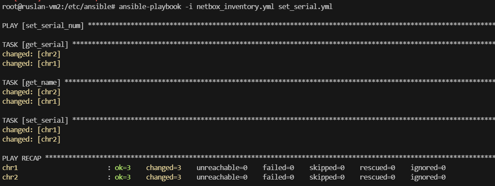

University: [ITMO University](https://itmo.ru/ru/)  
Faculty: [FICT](https://fict.itmo.ru)  
Course: [Network programming](https://github.com/itmo-ict-faculty/network-programming)  
Year: 2024/2025  
Group: K34212  
Author: Aukhadyev Ruslan Radikovich   
Lab: Lab3    
Date of create: 17.03.2025  
Date of finished: 17.03.2025  

## Отчёт о Лабораторной работе №3 <br>"Развертывание Netbox, сеть связи как источник правды в системе технического учета Netbox"

### Описание работы

В данной лабораторной работе вы ознакомитесь с интеграцией Ansible и Netbox и изучите методы сбора информации с помощью данной интеграции.


### Цель работы

С помощью Ansible и Netbox собрать всю возможную информацию об устройствах и сохранить их в отдельном файле.


### Ход работы

Для установки Netbox нам понадобятся postgres и redis. После установки postgres, создадим базу данных


Далее установим redis и склонируем репозиторий netbox


Создадим виртуальное окружение и загрузим необходимые библиотеки. Сгенерируем секретный ключ


Скопируем файл конфигурации netbox и заполним его

```
ALLOWED_HOSTS = ['localhost']
DATABASE = {
    'ENGINE': 'django.db.backends.postgresql',  # Database engine
    'NAME': 'netbox',         # Database name
    'USER': 'netbox',               # PostgreSQL username
    'PASSWORD': 'pass',           # PostgreSQL password
    'HOST': 'localhost',      # Database server
    'PORT': '',               # Database port (leave blank for default)
    'CONN_MAX_AGE': 300,      # Max database connection age
}
REDIS = {
    'tasks': {
        'HOST': 'localhost',
        'PORT': 6379,
        'USERNAME': '',
        'PASSWORD': '',
        'DATABASE': 0,
        'SSL': False,
    },
    'caching': {
        'HOST': 'localhost',
        'PORT': 6379,
        'USERNAME': '',
        'PASSWORD': '',
        'DATABASE': 1,
        'SSL': False,
    }
}
SECRET_KEY = 'qVBOXbN-(+f*#h%A_uO_VKwWfvr=IIr1W(+I%Ik=dO2D6JW$jv'
```

Выполняем миграции командой python3 manage.py migrate


Создаем суперпользователя


Запускаем с помощью команды python3 manage.py runserver 0.0.0.0:8000 и видим следующее


Выполняем python3 manage.py collectstatic и запускаем еще раз


Входим с данными суперпользователя


А далее у меня отключилась ВМ, и я больше не смог подключиться к ней по ssh. Проблема в настройках фаервола. Создадим новую ВМ с помощью снимка старого диска.
Добавляем в Netbox информацию о роли устройств, модели, производителе, сайте и вносим два chr


Добавим информацию об интерфейсах


Следующим шагом необходимо сохранить все данные из Netbox в отдельный файл. Для этого получим API токен в Netbox


Напишем yml файл, который собирает данные

```
plugin: netbox.netbox.nb_inventory
api_endpoint: http://84.201.164.196:8000
token: 0323ca4ee84b6cd80237c2dfa27d3d7a2890a474
validate_certs: true
config_context: false
interfaces: true
```

Запустим ansible-inventory с записью в netbox_inventory.yml


Далее необходимо было написать плейбук, изменяющий IP и имена роутеров

```
- name: config_routers
  hosts: ungrouped
  vars:
    ansible_network_cli_ssh_type: libssh
  gather_facts: false
  connection: community.routeros.api
  tasks:
    - name: set_name
      community.routeros.command:
        commands:
          - /system identity set name="{{ interfaces[0].device.name }}"
    - name: set_ip
      community.routeros.command:
        commands:
          - /interface bridge add name="{{ interfaces[0].display }}"
          - /ip address add address="{{ interfaces[0].ip_addresses[0].address }}" interface="{{ interfaces[0].display }}"
```

Вот такая ошибка при запуске, необходимо в netbox_inventory.yml добавить параметры ansible


Второй запуск успешен


Далее необходимо написать плейбук, который получает серийный номер роутера и заполняет его в netbox

```
- name: set_serial_num
  hosts: ungrouped
  vars:
    ansible_network_cli_ssh_type: libssh
  connection: community.routeros.api
  gather_facts: false
  tasks:
    - name: get_serial
      community.routeros.command:
        commands:
          - /system license print
      register: serial
    - name: get_name
      community.routeros.command:
        commands:
          - /system identity print
      register: ident
    - name: set_serial
      netbox_device:
        netbox_url: http://84.201.164.196:8000
        netbox_token: 0323ca4ee84b6cd80237c2dfa27d3d7a2890a474
        data:
          name: "{{ident.stdout_lines[0][0].split(' ').1}}"
          serial: "{{serial.stdout_lines[0][0].split(' ').1}}"
        state: present
        validate_certs: False
```

Запускаем



Проверим Netbox


### Вывод

В данной лабораторной работе было проведено знакомство с Netbox, сконфигурированы устройства в нем, написаны плейбуки для изменения имени и IP роутеров, взяв информацию из Netbox, и изменения серийного номера в Netbox, взяв информацию из роутеров.
